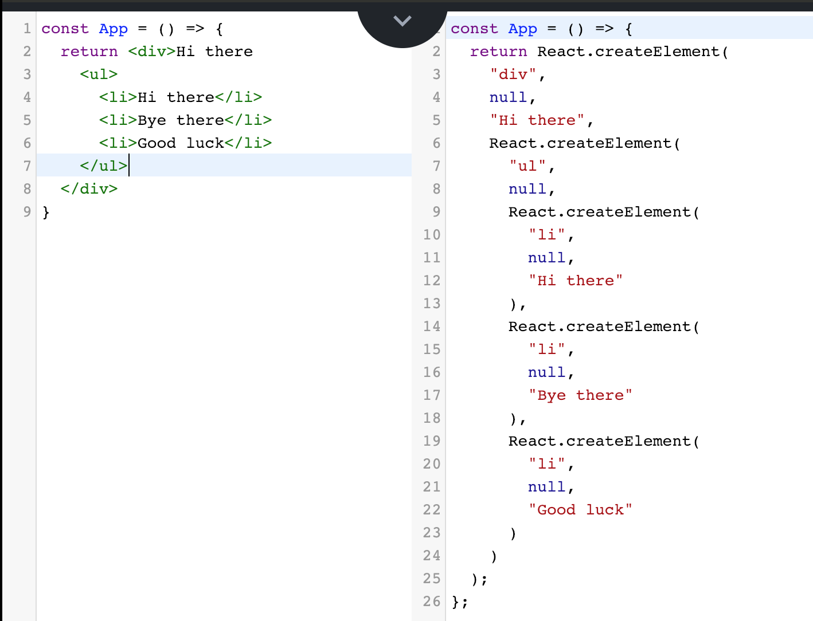
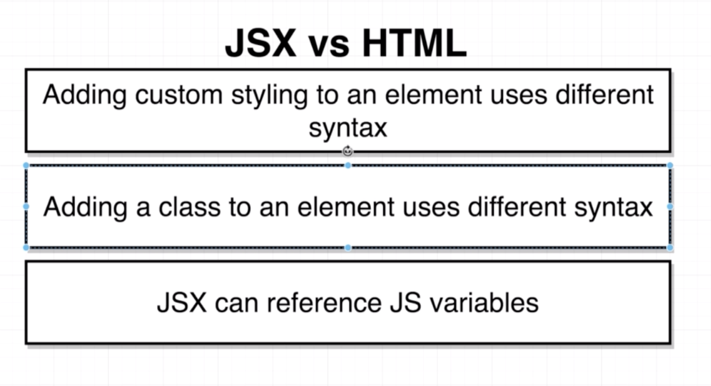

## SECTION 2


### 1. What is JSX?

  

babeljs.io를 방문해본다

ES5에 맞는 코드로 변환해준다. 



훨씬 쉬운 코드로 작성가능


### 2. Converting HTML to JSX


codepen.io 를 통해 연습

return 과 같은 라인에 component가 있어야한다.

\<div>를 아래로 내리고 싶다면 ();로 묶으면 됨



### 3. Inline styling with JSX

HTML

 	``<div style="background-color: red;"></div>``

JSX	

​	``<div style={{ backgroundColor: 'red' }}></div>``


### 4. Converting Styling to JSX format

JSX에서는 style 작성에 있어서 

1. camelCase 작성
2. double quotes 제거  "
3. double brace  {{ }}
4. semicolon 대신 comma ; -> , 


> HTML 'for' attribute
>
> label과 output의 요소로 쓰이며 어떤 component에 대한 label과
>
> output인지 특정지을 때 사용한다.
>
> ex) ``<label for="name">Enter name:</label>``


### 5. Class vs. ClassName

``<label class="label" for="name">``

=> ``<label className="label" for="name">``


JSX에서는 calssName을 써야만 하지만

``class  App extends React.component``

라는 키워드를 붙이면 class라고 사용할수있다.

하지만 나중에 편하려면 className으로 해라


### 6.Referencing JS variables in JSX


brace를 통해서 js variable들을 불러 올 수 있다.



```jsx
<button style={{backgroundColor: 'blue', color: 'white'}}>
      {buttonText}
 </button>
```


function call 또한 가능


### 7. Values JSX Can't show

string, number, array도 다 가능

array는 indices를 concatenate하여 보여줌


object로 넘길 시에 에러 발생

대신 {text: 'click me'}일 경우

buttonText.text로 넘겨주면 정상 작동한다.




```jsx
const App = () => {
  const buttonText = {text: 'click me'};
  const style = {backgroundColor: 'blue', color: 'white'};
  return (
  <div>
    <label className="label" for="name">
      Enter name:
    </label>
    <input id="name" type="text" />
    <button style={style}>
      {buttonText.text}
    </button>
  </div>
  );
}
```

style을 이러한 변수로 넘겨줄 수 있다. 


다시말해서 brace를 두번 사용하는 것은 js variable을 직접 안쪽에 작성해줬기 때문에 발생한 문법이다.

```jsx
const style = {backgroundColor: 'blue', color: 'white'};
<button style={style}>
    
// 위와 같음
<button style={{backgroundColor: 'blue', color: 'white'};}>
```


### 8. finding forbidden property names

className으로 고쳐주듯이

for 도 htmlFor로 고쳐줘야한다.

js의 문법 for loop와 구분해주기 위해서


### 9. Exercises

exercise ide를 제공한다!

{getTime()}을 집어넣고 끝났다...

