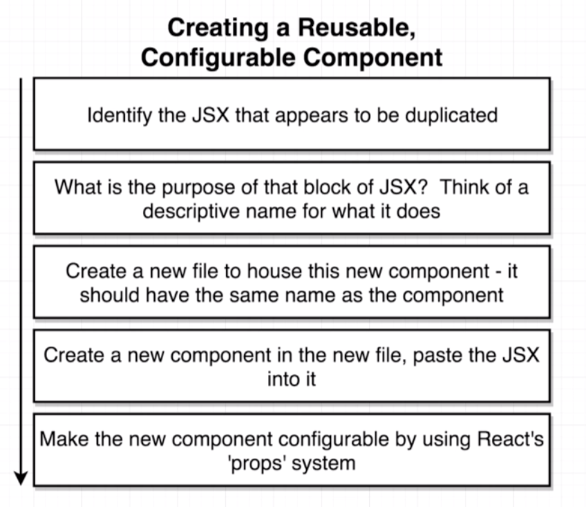

## Communicating with Props

### #1. Component Nesting

### #2. Component Reusability

### #3. Component Configuration

### 2. Application Overview

 어떠한 컴포넌트를 사용할지 미리보기

### 3. Getting Some Free Styling

### 4.Naive Component Approach

> div 와의 차이점으로 설명하는 span tag의 특징
>
> - display 속성이 block이 아닌 inline이다.
>
>   따라서 줄바꿈이 되지 않는다.

### 5. Specifying images in JSX

fake js 사용할 것이다. 

### 6. duplicating a single component

3개를 그대로 쓸 수는 있겠지만 이건 너무 비효율적이야

### 7. Extracting JSX to New Components

 

### 8. Component Nesting

CommentDetail.js라는 파일 생성 이후

import를 통해 index.js로 가져다 쓴다. 

### 9. React's Props System

같은 component에서 다른 내용물을 보여줄때 

 

### 10. Passing Multiple Props

props에서 key value처럼 꺼내먹음

### Passing Props- solutions

### 11. Component Reuse

### 12. Implementing an Approval Card

CommentDetail의 상위에 있어야할 Approval Card를 만들어보장

ApprovalCard.js 생성

index.js에서 불러옴

semantic-ui를 통해 적절한 className 호출

child component로 만들면 children이라는 것으로 묶여서 쓸 수 있다.

