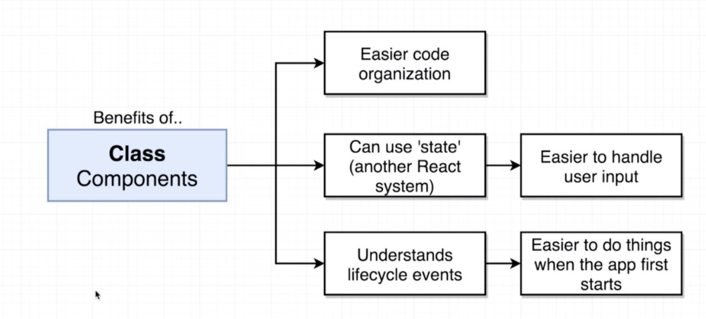

## Structing Apps with Class-based Components

### Class-based Components

A component is	Function

​					Class

Class-based Components에 대해 배울 것이다.

#### Functional과 Class의 차이는?

- functional: Good for simple content
- Class: Good for just about everything else

  

### Application Overview 

어떠한 계절인지 알아내고 그에 맞는 아웃풋을 보여준다.

### Getting a Users Physical location

